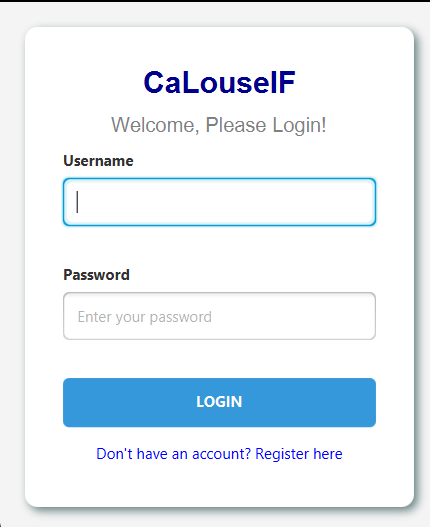

# CaLouselF: Sustainable Fashion Marketplace
## Description
CaLouselF is an innovative marketplace application designed to simplify the buying and selling of second-hand clothing in a safe and user-friendly environment. The platform connects sellers with buyers, enabling individuals to give their pre-loved clothing a second life, contributing to a more sustainable fashion ecosystem. By promoting sustainability, CaLouselF helps users discover unique and affordable fashion pieces while reducing waste in the fashion industry.

Key features of CaLouselF include customizable search filters and a smooth browsing experience. The platform is dedicated to fostering a community of fashion-conscious individuals who value sustainability and seek smarter, eco-friendly shopping options.


## Fitur Utama
# Login


## Prerequisites
To run the application, make sure you have the following software installed:

- Eclipse 2020.6 R (recommended for connecting JavaFX and SQL Connector, but any newer version of Eclipse will also work as long as Eclipse is installed)
- Java 11.0.11 (included within the repository)
- JavaFX 17.0.7 (included within the repository in the LibraryTambahan.zip file)
- MySQL Java Connection Library 8.0.24 (included within the repository in the LibraryTambahan.zip file)
- XAMPP 8.0.7 (optional, or you may use a more recent version)

## Instalasi

### Kloning Repositori
```bash
git clone https://github.com/username/nama-proyek.git
cd nama-proyek
```

### Buat Virtual Environment
```bash
python -m venv venv
source venv/bin/activate  # Untuk Linux/Mac
venv\Scripts\activate     # Untuk Windows
```

### Instal Dependensi
```bash
pip install -r requirements.txt
```

## Penggunaan

### Menjalankan Aplikasi
```bash
python main.py
```

### Contoh Penggunaan
```python
# Contoh kode penggunaan
from modul import fungsi

hasil = fungsi(parameter)
print(hasil)
```

## Struktur Proyek
```
nama-proyek/
│
├── src/
│   ├── main.py
│   └── modul.py
│
├── tests/
│   └── test_modul.py
│
├── docs/
│   └── dokumentasi.md
│
├── requirements.txt
├── README.md
└── LICENSE
```

## Konfigurasi
Salin `config.example.json` ke `config.json` dan sesuaikan pengaturan:

```json
{
    "database": "nama_database",
    "port": 8000,
    "debug": false
}
```

## Kontribusi
1. Fork repositori
2. Buat branch fitur (`git checkout -b fitur-baru`)
3. Commit perubahan (`git commit -m 'Tambah fitur baru'`)
4. Push ke branch (`git push origin fitur-baru`)
5. Buat Pull Request

## Lisensi
Proyek ini dilisensikan di bawah [Nama Lisensi] - lihat file LICENSE untuk detail.

## Kontak
- Nama Pengembang - email@example.com
- Link Proyek: [URL Repositori]

## Ucapan Terima Kasih
- [Nama Kontributor]
- [Library/Tools yang digunakan]
