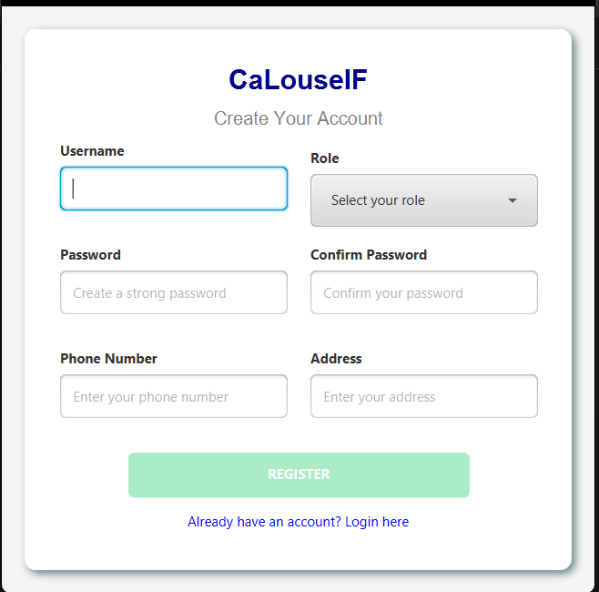

# CaLouselF: Sustainable Fashion Marketplace Desktop App

## Description
CaLouselF is an innovative marketplace application designed to simplify the buying and selling of second-hand clothing in a safe and user-friendly environment. The platform connects sellers with buyers, enabling individuals to give their pre-loved clothing a second life, contributing to a more sustainable fashion ecosystem. By promoting sustainability, CaLouselF helps users discover unique and affordable fashion pieces while reducing waste in the fashion industry.

Key features of CaLouselF include customizable search filters and a smooth browsing experience. The platform is dedicated to fostering a community of fashion-conscious individuals who value sustainability and seek smarter, eco-friendly shopping options.

**Technology Stack:**
- **Frontend:** Developed using **JavaFX**, providing a rich and interactive user interface.
- **Backend:** Utilizes **MySQL Connector Java** for seamless database connectivity.
- **Database:** Powered by **MySQL MariaDB**, ensuring robust data management and storage.

By leveraging these technologies, CaLouselF ensures a reliable and efficient platform for users to engage in sustainable fashion practices.

## Fitur Utama

<div align="center">
  <h3>1. Login</h3>
  
  <h3>2. Register</h3>
  
  <h3>3. View Item (Roles: Seller)</h3>
  
  <h3>4. Upload Item (Roles: Seller)</h3>
  
  <h3>5. View Offers (Roles: Seller)</h3>
  
  <h3>6. View Requested Item (Roles: Admin)</h3>
  
  <h3>7. View Approved Item (Roles: Customer)</h3>
  
  <h3>8. View Purchase History (Roles: Customer)</h3>
  
  <h3>9. View Wishlist (Roles: Customer)</h3>
  
</div>

## Prerequisites
To run the application, make sure you have the following software installed:

- Eclipse 2020.6 R (recommended for connecting JavaFX and SQL Connector, but any newer version of Eclipse will also work as long as Eclipse is installed)
- Java 11.0.11 (included within the repository)
- JavaFX 17.0.7 (included within the repository in the LibraryTambahan.zip file)
- MySQL Java Connection Library 8.0.24 (included within the repository in the LibraryTambahan.zip file)
- XAMPP 8.0.7 (optional, or you may use a more recent version)

## Instalasi

### Kloning Repositori
```bash
git clone https://github.com/KikiTom/CaLouselF_ProjectLab_OOAD.git
cd nama-proyek
```

### Import mysql calouself_localdb.sql
Langkah-langkah Setup Database
1. Jalankan XAMPP:
   - Buka aplikasi XAMPP Control Panel.
   - Klik Start pada Apache dan MySQL untuk menjalankan server.
2. Buat Database:
   - Akses phpMyAdmin melalui browser di http://localhost/phpmyadmin/.
   - Pilih tab Databases, buat database baru dengan nama calouself_localdb.
3. Import File SQL:
   - Pilih database calouself_localdb di phpMyAdmin.
   - Klik tab Import, pilih file calouself_localdb.sql dari folder repository, lalu klik Go untuk mengimpor.

### Setup build path javafx
silahkan ikuti langkah langkahnya didalam link ini
https://youtu.be/nz8P528uGjk?si=v-3Igk-G3FJiJRbn

## Struktur Proyek
```
CaLouselF-OOAD_Lab_Project/
│
├── src/
│   ├── Controller 
│   └── Main
|   └── Model
│   └── Repository
│   └── Service
│   └── View
│
│
├── JRE System Library (java 11)
│   
├── Resource (gambar button, profile picture, dan gambar produk)
├── README.md

```
Penjelasan Struktur Direktori
1. src/
   Folder utama yang berisi kode sumber dari aplikasi. Di dalamnya terdapat sub-direktori berikut:
     - Controller/: Berisi kelas-kelas yang mengontrol alur logika aplikasi.
     - Main/: Menyimpan kelas utama yang menjalankan aplikasi, biasanya berisi entry point aplikasi.
     - Model/: Menyimpan model data atau objek yang digunakan dalam aplikasi.
     - Repository/: Berisi kelas-kelas yang mengelola akses ke data (biasanya berhubungan dengan database atau file).
     - Service/: Berisi logika bisnis atau aturan yang digunakan oleh aplikasi.
     - View/: Menyimpan kelas atau komponen yang menangani tampilan atau antarmuka pengguna.
       
2. JRE System Library (java 11)
   Menunjukkan bahwa proyek ini menggunakan Java 11 sebagai runtime environment-nya.
   
3. Resource/
   Folder ini menyimpan berbagai file sumber daya (resource) yang digunakan oleh aplikasi, seperti:
     - Gambar button dan profile picture untuk tampilan antarmuka.
     - Gambar produk yang digunakan dalam aplikasi.
       
4. README.md
   File ini yang sedang kamu baca. Berisi dokumentasi tentang proyek ini, instruksi penggunaan, dan penjelasan terkait proyek.

## Lisensi
Proyek ini dilisensikan di bawah [Heru Deliansyah] - lihat file LICENSE untuk detail.

## Kontak
- Heru Deliansyah - heru.deliansyah@binus.ac.id
- Wisnu Putra - wisnu.putra001@binus.ac.id

## Ucapan Terima Kasih

- **W-ptra Dunkle_Vogel** - Repository, Model & Database  
  Terima kasih kepada **W-ptra Dunkle_Vogel** atas kontribusinya dalam pembuatan repository, model, dan database yang sangat membantu dalam pengembangan proyek ini.  
  [GitHub Repository](https://github.com/W-ptra)
